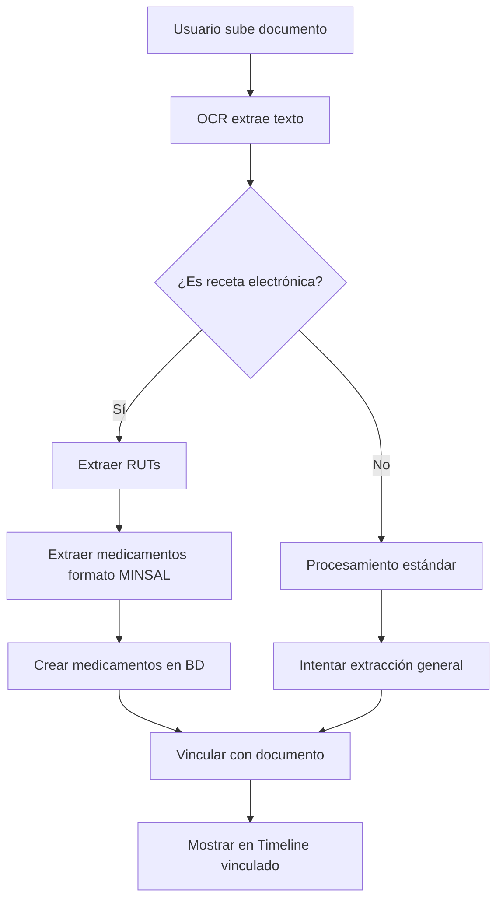

# 🇨🇱 Sistema de Reconocimiento de Recetas Electrónicas Chilenas

## 📋 Descripción

Klinip ahora tiene integración especializada para reconocer y procesar **Recetas Electrónicas del Sistema de Salud Chileno** (MINSAL).

Este sistema permite la interoperabilidad con el sistema público de salud, extrayendo automáticamente:
- Datos del médico (RUT y registro profesional)
- Datos del paciente (RUT)
- Medicamentos prescritos con dosis y administración
- Códigos de barras y códigos numéricos
- Información estructurada estándar

## 🎯 Características

### ✅ Detección Automática
El sistema detecta automáticamente si un documento es una receta electrónica chilena mediante:
- Formato estándar MINSAL
- Presencia de RUTs (formato XX.XXX.XXX-X)
- Códigos de barras
- Estructura de receta electrónica

### ✅ Extracción de Datos

#### 1. **Información del Médico**
```python
- RUT del médico
- Número de registro profesional (RIS)
- Nombre completo
```

#### 2. **Información del Paciente**
```python
- RUT del paciente
- Nombre completo
- Edad
- Dirección
```

#### 3. **Medicamentos**
Para cada medicamento se extrae:
```python
- Nombre del principio activo
- Dosis (mg, g, ml, etc.)
- Forma farmacéutica (comprimido, cápsula, jarabe, etc.)
- Cantidad a administrar
- Vía de administración (oral, tópica, etc.)
- Método de administración (tragar, masticar, etc.)
- Frecuencia (cada X horas)
- Periodo de tratamiento (duración en días)
```

## 📝 Formato Reconocido

### Ejemplo de Receta Electrónica:

```
MARÍA CONSTANZA ARRATIA ASCENCIO
Profesión: MÉDICO CIRUJANO
RUN: 18.851.767-7 / Registro RIS Nº: 9002130

Paciente: GISELLE INÉS ARRATIA ASCENCIO
RUT: 18.145.296-K
Edad: 33 años

Fecha de emisión: 2 de septiembre, 2025

RP (Prescripción)

ácido ascórbico 1000 mg comprimido

Administrar:
Dosis: 1 comprimido
Vía de Administración: oral
Método de Administración: Tragar
Frecuencia: Administrar cada 24 horas
Periodo de Tratamiento: Durante 45 días

pregabalina 75 mg cápsula

Administrar:
Dosis: 1 cápsula
Vía de Administración: oral
Método de Administración: Tragar
Frecuencia: Administrar cada 24 horas
Periodo de Tratamiento: Durante 30 días
Forma prescriptor: Iniciar con 1/2 comprimido PM x 3 días 
y luego aumentar a 75mg PM
```

## 🔧 Implementación Técnica

### Funciones Principales

#### 1. `_is_electronic_prescription(text: str) -> bool`
Detecta si el documento es una receta electrónica chilena.

```python
# Indicadores:
- Palabras clave: "receta electrónica", "RP prescripción", "MINSAL"
- Formato de RUT chileno
- Códigos de barras
- Estructura estándar
```

#### 2. `_extract_rut(text: str) -> dict`
Extrae los RUTs del médico y paciente.

```python
{
    "patient_rut": "18.145.296-K",
    "doctor_rut": "18.851.767-7",
    "doctor_registry": "9002130"
}
```

#### 3. `_extract_electronic_prescription_meds(text: str) -> list[dict]`
Extrae todos los medicamentos con sus detalles.

```python
[
    {
        "name": "ácido ascórbico",
        "dose": "1000 mg",
        "frequency": "1 comprimido, vía oral, tragar, cada 24 horas",
        "duration_days": 45,
        "route": "oral",
        "form": "comprimido",
        "raw": "ácido ascórbico 1000 mg comprimido"
    },
    {
        "name": "pregabalina",
        "dose": "75 mg",
        "frequency": "1 cápsula, vía oral, tragar, cada 24 horas",
        "duration_days": 30,
        "route": "oral",
        "form": "cápsula",
        "raw": "pregabalina 75 mg cápsula"
    }
]
```

## 📊 Flujo de Procesamiento



## 🎨 Visualización en la App

### En la sección de Documentos:
```
📄 Receta Electrónica
📋 Receta Electrónica MINSAL
Paciente RUT: 18.145.296-K | Médico RUT: 18.851.767-7 | Registro: 9002130

💊 ácido ascórbico: 1000 mg - 1 comprimido, vía oral, tragar, cada 24 horas
💊 pregabalina: 75 mg - 1 cápsula, vía oral, tragar, cada 24 horas
```

### En la sección de Medicamentos:
Cada medicamento se crea automáticamente con:
- Nombre
- Dosis
- Frecuencia completa
- Duración (cálculo de fecha fin)
- Vinculación con el documento de origen

### En la Historia Clínica (Timeline):
```
┌─────────────────────────────────────────────┐
│ 📄 Receta                                    │
│ 📋 Receta Electrónica MINSAL                │
│ 🔗 2 vinculados                             │
│                                              │
│ ▶ Ver elementos relacionados                │
│   ┌────────────────────────────────────────┐│
│   │ 💊 Medicamentos:                       ││
│   │ • ácido ascórbico 1000 mg              ││
│   │ • pregabalina 75 mg                    ││
│   └────────────────────────────────────────┘│
└─────────────────────────────────────────────┘
```

## 🔐 Validación de RUT Chileno

El sistema reconoce RUTs en los formatos:
- `XX.XXX.XXX-X`
- `XXXXXXXX-X`
- Con dígito verificador (incluyendo 'K')

## 📱 Códigos de Barras

El sistema detecta:
- Códigos de barras numéricos (13 dígitos)
- Códigos alfanuméricos con formato `*XXXXX*`
- Códigos QR (para futuras versiones)

## 🌐 Interoperabilidad

Este sistema permite a Klinip:
- ✅ Integrarse con el sistema público de salud chileno
- ✅ Procesar recetas del MINSAL
- ✅ Mantener trazabilidad médico-paciente
- ✅ Cumplir con estándares nacionales
- ✅ Facilitar auditorías y seguimiento

## 📚 Formatos Soportados

### Entrada:
- ✅ PDF (recetas electrónicas escaneadas)
- ✅ Imágenes (PNG, JPG, JPEG)
- ✅ Multi-página (hasta 3 páginas por documento)

### Procesamiento:
- ✅ OCR con Tesseract
- ✅ Preprocesamiento de imagen (mejora de contraste, escalado)
- ✅ Detección inteligente de patrones

## 🚀 Mejoras Futuras

### Próximas versiones incluirán:
- [ ] Lectura directa de códigos de barras
- [ ] Extracción de códigos QR
- [ ] Validación en línea con MINSAL
- [ ] Verificación de RUT con dígito verificador
- [ ] Detección de recetas duplicadas
- [ ] Alertas de interacciones medicamentosas
- [ ] Exportación en formato FHIR

## 🧪 Cómo Probar

1. **Sube una receta electrónica chilena** (PDF o imagen)
2. **Clasifícala como "Receta"**
3. **Espera el procesamiento OCR**
4. **Revisa**:
   - Los medicamentos extraídos en "Medicamentos"
   - La información de RUTs en las notas del documento
   - La vinculación en la "Historia Clínica"

## 📞 Soporte

Para reportar problemas con el reconocimiento de recetas electrónicas:
- Asegúrate de que la imagen sea clara y legible
- Verifica que el formato sea similar al estándar MINSAL
- El OCR funciona mejor con imágenes de alta resolución
- PDFs nativos funcionan mejor que PDFs escaneados

## ⚠️ Importante

- Este sistema es de **apoyo** y no reemplaza la revisión manual
- Siempre verifica los datos extraídos
- Los medicamentos se vinculan automáticamente, pero puedes editarlos
- La información de RUTs es solo para trazabilidad interna

---

**Desarrollado para Klinip - Sistema de Gestión de Salud Personal** 🏥


